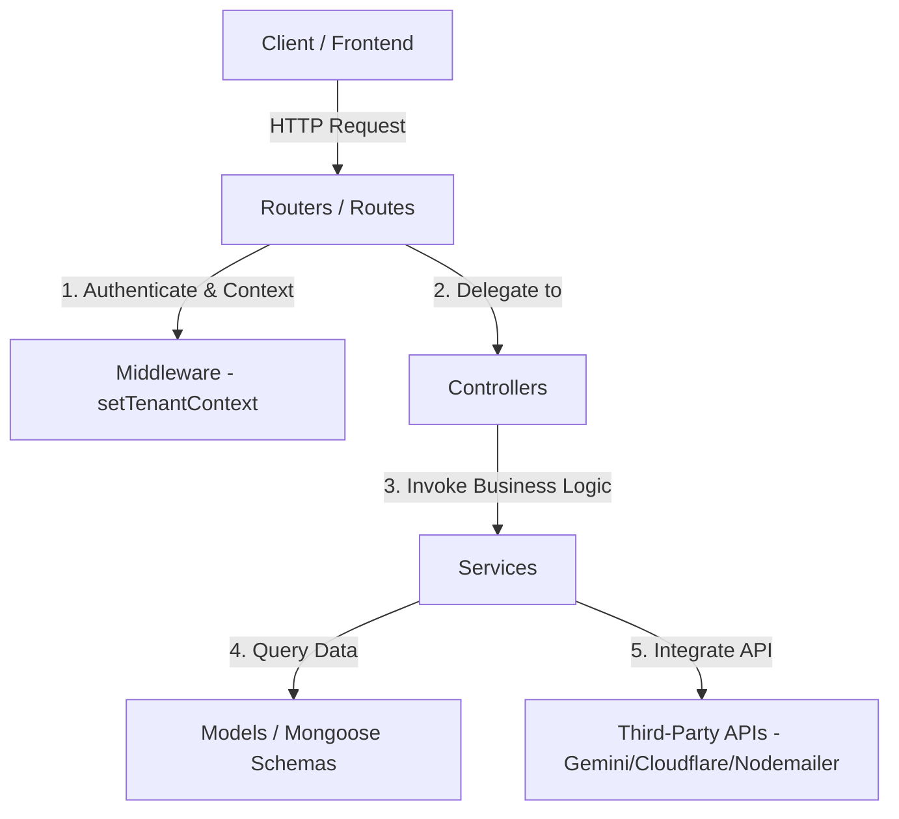

# 🖥️ Note Loom — Backend Server API

The backend for the **Note Loom** multi-tenant college management platform. It provides a RESTful API built on **Node.js, Express, and MongoDB (Mongoose)**, powered by Google Gemini and Cloudflare AI services.

The codebase implements a clean **Controller-Service-Repository** architectural model, separating HTTP routing from core business logic, database queries, and third-party integrations.

---

## 🏗️ Architectural Model (Clean Layered Architecture)

The backend separates concerns across distinct layers to support easy maintenance, scalability, and stateless deployments:



*   **Routers (`/routes`):** Lightweight mapping files that define URL paths, middleware guards, and delegate execution to controllers.
*   **Controllers (`/controllers`):** Handle HTTP request parsing, payload validation, status codes, and HTTP responses.
*   **Services (`/services`):** Pure Javascript files holding the core business logic, third-party integrations (Nodemailer, Gemini, Cloudflare AI), and file-system/document parsers.
*   **Models (`/models`):** Mongoose schemas defining database structures.

---

## 📁 Directory Structure

```
noteloom-backend/
├── server.js               # Entry point (bootstraps database & HTTP server)
├── vercel.json             # Serverless deployment configuration
├── .gitignore              # Ignored local config, temp files, and logs
│
├── 📁 config/              # Central configurations
│   ├── db.js               # MongoDB database connection
│   └── systemRoles.js      # System role mappings and permissions
│
├── 📁 middleware/          # Express route middlewares
│   └── authMiddleware.js   # JWT verification & multi-tenant context injector
│
├── 📁 routes/              # Thin routes mapping endpoints to controllers
│   ├── authRoutes.js
│   ├── aiRoutes.js
│   ├── coeRoutes.js
│   └── leaveRoutes.js
│
├── 📁 controllers/         # Handles HTTP requests & response formatting
│   ├── authController.js
│   ├── aiController.js
│   ├── coeController.js
│   └── questionBankController.js
│
├── 📁 services/            # Main business logic and integrations
│   ├── emailService.js     # Nodemailer SMTP dispatcher
│   ├── ocrService.js       # Local Tesseract OCR processing
│   ├── fileParserService.js# Word, Excel, PowerPoint, & PDF text extraction
│   ├── geminiService.js    # Gemini client, File API uploads, & retries
│   └── cloudflareService.js# Cloudflare AI (Llama, Whisper) fallbacks
│
├── 📁 models/              # Mongoose/MongoDB data collections (33 schemas)
│   ├── User.js
│   ├── Tenant.js
│   ├── Membership.js
│   └── ...
│
├── 📁 templates/           # HTML and template layouts
│   └── emailTemplates.js   # Mail templates (e.g., OTP verification layout)
│
├── 📁 utils/               # General utility helpers and mapping files
│   └── userDTO.js          # Centralized user profile DTO mapper
│
└── 📁 scripts/             # Seeding and testing operations
    ├── seed.js             # Initial database seeder
    └── runTests.js         # Complete backend integration test suite
```

---

## 🛠️ Tech Stack & Key Integrations
*   **Core:** Node.js, Express, Mongoose, JWT (jsonwebtoken), bcryptjs
*   **File Parsing:** Mammoth (.docx), ExcelJS (.xlsx), Officeparser (.pptx), pdf-parse (.pdf), fluent-ffmpeg (video audio extraction)
*   **AI Models:** Google Gemini 2.5 Flash Lite (generative-ai SDK) with Cloudflare Workers AI fallback (Llama 3, Whisper audio-to-text)
*   **OCR Engine:** Local Tesseract.js (embedded fallback for offline/scanned files)
*   **Email:** Nodemailer (SMTP transport for OTP delivery)

---

## 🚀 Running Locally

### 1. Prerequisites
Ensure you have Node.js 18+ and a running MongoDB instance.

### 2. Environment Variables (.env)
Create a `.env` file in the backend root based on `.env.example`:
```env
PORT=4000
MONGO_URI=mongodb+srv://...
JWT_SECRET=your_jwt_secret

# AI Configurations
GEMINI_API_KEY=your_gemini_key
CLOUDFLARE_ACCOUNT_ID=your_cloudflare_id
CLOUDFLARE_API_TOKEN=your_cloudflare_token

# Email Configurations
EMAIL_USER=your_gmail_or_smtp_address
EMAIL_PASS=your_gmail_app_password
```

### 3. Start Server
Install dependencies and run in development mode (with nodemon):
```bash
npm install
npm run dev
```
The server will start listening at `http://localhost:4000`.

---

## 🧪 Testing

The backend includes a comprehensive integration test suite verifying routing, health status, auth flows, database operations, and middleware guards.

To run the tests, execute:
```bash
node scripts/runTests.js
```
All 38 test suites will run against your active server (port 4000) and verify correct behavior.